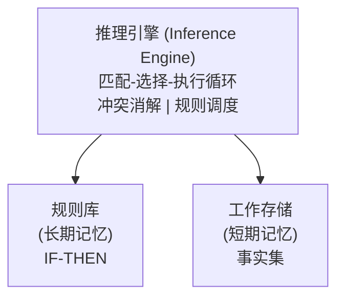
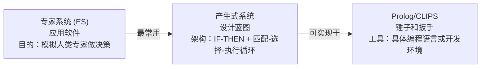

# 01-符号主义AI：逻辑、知识表示与专家系统

> **本文定位**：开卷考试中"古典AI"相关题目的核心参考文档。涵盖从亚里士多德到CLIPS的全部符号主义内容。
> **老师偏好**：古典概念解释题、手算子句转换/归结反驳、知识表示方法辨析、CLIPS规则追踪。

---

## 目录

- [一、AI的哲学与历史基础](#一ai的哲学与历史基础)
- [二、命题逻辑](#二命题逻辑)
- [三、一阶谓词逻辑](#三一阶谓词逻辑)
- [四、合一（Unification）](#四合一unification)
- [五、归结反驳（Resolution Refutation）](#五归结反驳resolution-refutation)
- [六、知识表示方法](#六知识表示方法)
- [七、产生式系统与推理引擎](#七产生式系统与推理引擎)
- [八、Prolog逻辑编程](#八prolog逻辑编程)
- [九、CLIPS专家系统](#九clips专家系统)
- [十、经典专家系统案例](#十经典专家系统案例)
- [十一、符号主义AI的定位与反思](#十一符号主义ai的定位与反思)
- [附录A：公式速查表](#附录a公式速查表)
- [附录B：常见考试题型与答题模板](#附录b常见考试题型与答题模板)
- [附录C：教师可能课堂扩展内容](#附录c教师可能课堂扩展内容)

---

## 一、AI的哲学与历史基础

### 1.1 关键人物与思想（必考概念解释）

| 人物 | 核心贡献 | 考试关键词 |
|------|----------|-----------|
| **Aristotle（亚里士多德）** | 三段论（Syllogism）：所有人会死→苏格拉底是人→苏格拉底会死。这是 **Modus Ponens** 的早期形式 | 三段论、演绎推理 |
| **Hobbes（霍布斯）** | "**Reasoning is but reckoning**"（推理即计算）——这是AI的根本哲学前提 | 推理=计算，AI哲学基础 |
| **Descartes（笛卡尔）** | "我思故我在"；心物交互，认为思维可由物理系统实现 | 心物二元论 |
| **Leibniz（莱布尼茨）** | 形式逻辑 + 计算装置设想（通用字符集） | 逻辑机器 |
| **Boole（布尔）** | 布尔代数，现代计算机逻辑基础 | 布尔代数 |
| **Frege（弗雷格）** | 算术的形式化语言，谓词逻辑奠基 | 形式语言 |
| **Tarski（塔斯基）** | 语义真值理论——公式可精确对应现实世界 | 语义理论、真值表 |
| **Turing（图灵）** | 计算理论、图灵测试：什么是思考？什么是机器？什么是智能？ | 图灵测试 |
| **Wittgenstein（维特根斯坦）** | "什么是椅子？"——质疑定义的模糊性，暗示AI定义的困难 | 定义困境 |

> **直观理解**：AI的哲学路线是——"如果推理=计算（Hobbes），而计算=符号操作（Boole/Frege），那么智能=符号操作"。这就是**物理符号系统假说**（Newell & Simon）的核心逻辑。

### 1.2 Tarski语义与真值表手算

**问题**（讲义经典题）：已知 $(A \lor C) \lor (B \lor \lnot C)$ 为真，问 $(A \lor B)$ 是否一定为真？

**指令级手算步骤**：

| Step | 操作 |
|------|------|
| 1 | 列出所有8种可能的布尔组合（A,B,C各有T/F） |
| 2 | 对每行计算前提 $(A\lor C)\lor(B\lor\lnot C)$ 的真值 |
| 3 | 对每行计算结论 $(A\lor B)$ 的真值 |
| 4 | **关键判断**：检视所有**前提为真**的行，结论是否也为真？ |
| 5 | 如果存在一行前提真但结论假 → **不蕴含**；如果全部一致 → **蕴含** |

| A | B | C | $\lnot C$ | $A\lor C$ | $B\lor\lnot C$ | 前提 | $A\lor B$ | 前提→结论? |
|---|---|---|-----|-----|------|------|-----|-----------|
| T | T | T | F | T | T | T | T | [OK] |
| T | T | F | T | T | T | T | T | [OK] |
| T | F | T | F | T | F | T | T | [OK] |
| T | F | F | T | T | T | T | T | [OK] |
| F | T | T | F | T | T | T | T | [OK] |
| F | T | F | T | F | T | T | T | [OK] |
| F | F | T | F | T | F | T | **F** | **[NO] 反例！** |
| F | F | F | T | F | T | T | **F** | **[NO] 反例！** |

**结论**：第7行（A=F, B=F, C=T）和第8行（A=F, B=F, C=F）中，前提为真但结论为假 → **不蕴含**。

> **考试关注点**：给一个逻辑蕴含判定问题，构造真值表回答"是否蕴含"。

---

## 二、命题逻辑

### 2.1 基本连接词真值表

| P | Q | $\lnot P$ | $P\land Q$ | $P\lor Q$ | $P\to Q$ | $P\equiv Q$ |
|---|---|----|-----|-----|-----|-----|
| T | T | F | T | T | T | T |
| T | F | F | F | T | F | F |
| F | T | T | F | T | T | F |
| F | F | T | F | F | T | T |

> **记忆要点**：$P\to Q$ 仅在 P真且Q假 时为假（承诺不可违背）。$P\equiv Q$ 在同真或同假时为真。

### 2.2 重要等价关系（必背）

| 定律 | 公式 | 手算验证方法 |
|------|------|-------------|
| 双重否定 | $\lnot(\lnot P) \equiv P$ | 真值表：$\lnot P$列再取反 |
| 蕴含转换 | $P\to Q \equiv \lnot P\lor Q$ | 两列真值是否一致 |
| 逆否律 | $P\to Q \equiv \lnot Q\to\lnot P$ | 两列真值是否一致 |
| 德摩根律1 | $\lnot(P\lor Q) \equiv \lnot P\land\lnot Q$ | 两列真值是否一致 |
| 德摩根律2 | $\lnot(P\land Q) \equiv \lnot P\lor\lnot Q$ | 两列真值是否一致 |

> **直观理解**：德摩根律可以这样记——"把否定号推进括号时，$\land$变$\lor$，$\lor$变$\land$"（像分配律）。

### 2.3 逻辑蕴含的判定（真值表法·指令级）

**给任何命题逻辑蕴含问题，按下述步骤：**
1. 列出所有命题变量（如 P, Q, R）
2. 构造真值表（有 n 个变量则为 2ⁿ 行）
3. 逐列计算子表达式
4. 标记所有前提为真的行
5. 检查这些行中结论是否都为真

---

## 三、一阶谓词逻辑

### 3.1 语法要素

| 要素 | 符号约定 | 例子 |
|------|---------|------|
| **常量** | 小写开头 | `socrates`, `0`, `π` |
| **变量** | 小写开头 | `x`, `y`, `z` |
| **函数** | 小写开头 + 元数 | `father(x)`, `sum(x,y)` |
| **谓词** | 小写开头 + 元数 | `man(x)`, `parent(x,y)` |
| **全称量词** | $\forall$ | $\forall x\,\text{man}(x)\to\text{mortal}(x)$（所有人都会死） |
| **存在量词** | $\exists$ | $\exists x\,\text{man}(x)\land\lnot\text{mortal}(x)$（有人不会死） |

> **直观理解**：$\forall$ = "对所有"，$\exists$ = "存在至少一个"。

### 3.2 经典示例：Socrates三段论

$$
\begin{aligned}
&\forall x (\text{man}(x) \to \text{mortal}(x)) \quad \text{"所有人都会死"} \\
&\text{man}(\text{Socrates}) \quad \text{"苏格拉底是人"} \\
&\text{mortal}(\text{Socrates}) \quad \text{"苏格拉底会死"}
\end{aligned}
$$

推理步骤（全称实例化 + 假言推理）：
1. $\forall x (\text{man}(x) \to \text{mortal}(x))$ 实例化 x=Socrates → $\text{man}(\text{Socrates}) \to \text{mortal}(\text{Socrates})$
2. 已知 $\text{man}(\text{Socrates})$，用 Modus Ponens → $\text{mortal}(\text{Socrates})$ [OK]

### 3.3 自然语言 → FOL形式化（手算指令）

**做题步骤：**
1. 识别域（讨论的对象集合，如"所有人"）
2. 识别谓词（属性/关系）
3. 识别量词（全称还是存在？）
4. 写出公式

| 自然语言 | FOL |
|---------|-----|
| 所有人都会死 | $\forall x (\text{man}(x) \to \text{mortal}(x))$ |
| 有人不会死 | $\exists x (\text{man}(x) \land \lnot\text{mortal}(x))$ |
| 没有人是完美的 | $\forall x\,\lnot\text{perfect}(x)$ 或 $\lnot\exists x\,\text{perfect}(x)$ |
| 每个学生都喜欢某门课 | $\forall x\,\exists y\,(\text{student}(x) \to (\text{course}(y) \land \text{likes}(x,y)))$ |

> **常见错误**：$\forall x (\text{man}(x) \land \text{mortal}(x))$ 意思是"所有东西都是人且都会死"——这是错的！全称量词后用 $\to$，存在量词后用 $\land$。

### 3.4 解释与语义

- **域 D**：非空集合（讨论的对象范围）
- **解释 I**：
  - 每个常量 → D 中一个元素
  - 每个 n 元函数 → Dⁿ→D 的映射
  - 每个 n 元谓词 → Dⁿ→{true, false} 的映射
- **真值判定**：
  - $\forall x\,s$ 为真 $\leftrightarrow$ 对 D 中所有元素 a，将 x 替换为 a 后 s 为真
  - $\exists x\,s$ 为真 $\leftrightarrow$ 存在 D 中某元素 a，将 x 替换为 a 后 s 为真

### 3.5 可满足、有效、不一致

| 概念 | 定义 | 例子 |
|------|------|------|
| **可满足** | 存在解释I和赋值使公式为真 | `P(x)`（选I使P(x)=true即可） |
| **有效** | 所有解释下都为真 | $P(x) \lor \lnot P(x)$ |
| **不一致/不可满足** | 不存在使其为真的解释 | $\exists x(P(x) \land \lnot P(x))$ |

---

## 四、合一（Unification）

### 4.1 直观理解

> **合一就是"找一组替换，让两个表达式变得一模一样"**。比如 `f(x, a)` 和 `f(b, y)`，用 `{b/x, a/y}` 替换后都是 `f(b, a)`。

### 4.2 合一的条件

1. **常量不可被替换**：不能把 `b` 替换掉
2. **出现检查（Occur Check）**：变量不能与包含该变量的项合一。如 `x` 不能与 `f(x)` 合一（会导致无限嵌套）
3. **替换必须一致**：同一变量的所有出现必须被替换为相同项

### 4.3 MGU（最一般合一子）手算指令

**例题**：求 `parents(x, father(x), mother(bill))` 与 `parents(bill, father(bill), y)` 的 MGU。

| Step | 操作 | 结果 |
|------|------|------|
| 1 | 对齐两个表达式，逐位置比较 | 位置1: x vs bill；位置2: father(x) vs father(bill)；位置3: mother(bill) vs y |
| 2 | 位置1：x=常量bill → 替换 `{bill/x}` | — |
| 3 | 位置2：应用替换后 father(bill) vs father(bill) → 一致 | — |
| 4 | 位置3：y=mother(bill) → 替换 `{mother(bill)/y}` | — |
| 5 | 合并：`{bill/x, mother(bill)/y}` | MGU |

> **考试关注点**：给两个项，找MGU。注意出现检查。

---

## 五、归结反驳（Resolution Refutation）

### 5.1 核心思想

> **直观理解**：想证明"P成立"，就假设"P不成立"，把它和已知前提一起放进归结系统。如果推出矛盾（空子句$\Box$），则说明"P不成立"这个假设是错的，所以P成立。这就是**反证法**的自动化版本。

### 5.2 推理规则速查

| 规则 | 形式 | 结论 |
|------|------|------|
| 假言推理 (Modus Ponens) | $P, P\to Q$ | $Q$ |
| 否定后件 (Modus Tollens) | $P\to Q, \lnot Q$ | $\lnot P$ |
| 合取消去 | $P\land Q$ | $P$（或$Q$） |
| 合取引入 | $P, Q$ | $P\land Q$ |
| 全称实例化 | $\forall x\,P(x)$ | $P(a)$（a在域中） |

### 5.3 9步子句形式转换（指令级·必考）

**给任何一个FOL公式，按以下9步转为子句形式：**

| Step | 操作 | 说明 | 例子（作用于 $\lnot\forall x[P(x)\to\exists y\,Q(x,y)]$）|
|------|------|------|------|
| **1** | **消去蕴含** | $a\to b$ → $\lnot a\lor b$ | $\lnot\forall x[\lnot P(x) \lor \exists y\,Q(x,y)]$ |
| **2** | **缩小否定范围** | 德摩根律 + 量词否定 | $\exists x\,\lnot[\lnot P(x) \lor \exists y\,Q(x,y)] = \exists x[P(x) \land \lnot\exists y\,Q(x,y)] = \exists x[P(x) \land \forall y\,\lnot Q(x,y)]$ |
| | 量词否定规则： | $\lnot\forall x\,a(x) \equiv \exists x\,\lnot a(x)$ | |
| | | $\lnot\exists x\,a(x) \equiv \forall x\,\lnot a(x)$ | |
| **3** | **标准化变量** | 不同量词的变量用不同名 | 如已唯一则跳过 |
| **4** | **量词左移** | 移到公式最外层（前束范式） | $\exists x\,\forall y\,[P(x) \land \lnot Q(x,y)]$ |
| **5** | **Skolem化** | 消去存在量词，用Skolem函数/常量替换 | $\forall y\,[P(a) \land \lnot Q(a,y)]$（x变为常量a） |
| | 规则： | 若$\exists x$在$\forall y_1...\forall y_n$的辖域内→用$f(y_1...y_n)$替换$x$ | |
| | | 若$\exists x$不在任何$\forall$辖域内→用新常量替换$x$ | |
| **6** | **去掉全称量词** | 剩余变量都全称量化（隐含） | $P(a) \land \lnot Q(a,y)$ |
| **7** | **化为CNF** | 用分配律展开 | 已满足 |
| **8** | **拆分为子句** | 每个合取项一个子句 | ①$P(a)$ ②$\lnot Q(a,y)$ |
| **9** | **标准化变量（再次）** | 不同子句的变量用不同名 | 已满足 |

> **Skolem化的直观理解**：存在量词说"存在某个x"，既然它存在，我们就给它起个名字。如果这个x依赖于某些全称变量（如"每个人都有一个父亲"），则用一个函数表示这种依赖关系（`father(x)`）。如果不依赖任何全称变量，就是一个新常量。

### 5.4 完整归结手算示例：Happy Student

**题目**（经典必练）：
$$
\begin{aligned}
&\forall x[\text{pass}(x,\text{history}) \land \text{win}(x,\text{lottery}) \to \text{happy}(x)] \\
&\forall x\forall y[\text{study}(x) \lor \text{lucky}(x) \to \text{pass}(x,y)] \\
&\lnot \text{study}(\text{john}) \land \text{lucky}(\text{john}) \\
&\forall x[\text{lucky}(x) \to \text{win}(x,\text{lottery})] \\
&\text{证明: } \text{happy}(\text{john})
\end{aligned}
$$

**Step 1: 转为子句形式**

前提1: $\forall x[\text{pass}(x,\text{history}) \land \text{win}(x,\text{lottery}) \to \text{happy}(x)]$
→ $\forall x[\lnot(\text{pass}(x,\text{history}) \land \text{win}(x,\text{lottery})) \lor \text{happy}(x)]$
→ $\forall x[\lnot\text{pass}(x,\text{history}) \lor \lnot\text{win}(x,\text{lottery}) \lor \text{happy}(x)]$
→ 子句①: $\lnot\text{pass}(x,\text{history}) \lor \lnot\text{win}(x,\text{lottery}) \lor \text{happy}(x)$

前提2: $\forall x\forall y[\text{study}(x) \lor \text{lucky}(x) \to \text{pass}(x,y)]$
→ $\forall x\forall y[\lnot(\text{study}(x) \lor \text{lucky}(x)) \lor \text{pass}(x,y)]$
→ $\forall x\forall y[(\lnot\text{study}(x) \land \lnot\text{lucky}(x)) \lor \text{pass}(x,y)]$
→ $\forall x\forall y[(\lnot\text{study}(x) \lor \text{pass}(x,y)) \land (\lnot\text{lucky}(x) \lor \text{pass}(x,y))]$
→ 子句②a: $\lnot\text{study}(y) \lor \text{pass}(y,z)$
→ 子句②b: $\lnot\text{lucky}(w) \lor \text{pass}(w,v)$

前提3: $\lnot\text{study}(\text{john}) \land \text{lucky}(\text{john})$
→ 子句③a: $\lnot\text{study}(\text{john})$
→ 子句③b: $\text{lucky}(\text{john})$

前提4: $\forall x[\text{lucky}(x) \to \text{win}(x,\text{lottery})]$
→ $\forall x[\lnot\text{lucky}(x) \lor \text{win}(x,\text{lottery})]$
→ 子句④: $\lnot\text{lucky}(u) \lor \text{win}(u,\text{lottery})$

否定结论: $\lnot\text{happy}(\text{john})$
→ 子句⑤: $\lnot\text{happy}(\text{john})$

**Step 2: 归结过程**

归结树（从目标反向推）：

$⑤\ \lnot\text{happy}(\text{john}) \quad + \quad ①\ \{\text{john}/x\}$
&emsp;↓ (归结，消去happy(john)和其否定)
$⑥\ \lnot\text{pass}(\text{john},\text{history}) \lor \lnot\text{win}(\text{john},\text{lottery})$

$⑥ + ④\ \{\text{john}/u\}$
&emsp;↓ (归结，消去win(john,lottery)和其否定)
$⑦\ \lnot\text{pass}(\text{john},\text{history}) \lor \lnot\text{lucky}(\text{john})$

$⑦ + ③b\ \text{lucky}(\text{john})$
&emsp;↓ (归结，消去lucky(john)和其否定)
$⑧\ \lnot\text{pass}(\text{john},\text{history})$

$⑧ + ②b\ \{\text{john}/w,\ \text{history}/v\}$
&emsp;↓ (归结，消去pass(john,history)和其否定)
$⑨\ \lnot\text{lucky}(\text{john})$

$⑨ + ③b\ \text{lucky}(\text{john})$
&emsp;↓ (归结，两个互补文字)
&emsp;$\Box$ (空子句 → 矛盾 → 证明完成!)

> **考试关注点**：给一组自然语言前提和一个结论，完整手算子句转换 + 归结树。每一步标注使用的替换。

---

## 六、知识表示方法

### 6.1 七种核心方法对比总表（考试重点）

| 方法 | 核心单元 | 结构 | 推理方式 | 典型应用 |
|------|---------|------|---------|---------|
| **语义网络** | 节点 + 有向弧 | 图（ISA/AKO层次） | 继承推理（沿ISA链向上传播） | 分类系统、本体 |
| **框架（Frame）** | 槽 + 侧面 | 结构化对象模板 | 默认推理、继承 | 场景理解、原型表示 |
| **概念图** | 概念节点 + 关系节点 | 二分图 | 限制/连接/简化 | 自然语言语义 |
| **产生式规则** | IF-THEN | 独立规则集 | 前向/后向链 | 专家系统 |
| **三元组（RDF）** | (主体, 谓词, 客体) | 有向边 | SPARQL图查询 | 知识图谱（Wikidata） |
| **脚本（Script）** | 事件序列 | 场景→角色→道具→场景→结果 | 模式匹配预测 | 故事理解 |
| **其他** | — | — | — | — |

### 6.2 语义网络

> **直观理解**：语义网络就是画一个"概念地图"——节点是概念，箭头是关系。沿着箭头走就能推理出新知识。

**关键关系类型**：
- `ISA`：是...的一个实例（Tweety `ISA` Canary）
- `AKO`（A Kind Of）：是...的子类（Canary `AKO` Bird）
- `CAN-FLY`、`COLOR` 等：属性关系

**继承推理示例**：
```
Tweety →ISA→ Canary →ISA→ Bird →CAN-FLY→ Fly
追问: "Can Tweety fly?"
推理: 沿着ISA链找到Bird的CAN-FLY属性 → YES
```

### 6.3 框架（Frame）

> **直观理解**：框架就像"填空题模板"。比如"鸟"这个框架：有羽毛?___(默认true)，会飞?___(默认true)，颜色?___。当你填"企鹅"时，把"会飞"覆盖为false，其他继承默认值。

**槽的类型（讲义第7页）**：
1. **标识信息**：框架名称/ID
2. **与其他框架的关系**：ISA, AKO
3. **需求描述**：槽必须满足的约束
4. **过程信息**：与槽相关的计算方法
5. **默认信息**：无具体值时的默认值（**这是框架的核心优势**）
6. **新实例信息**：创建时的具体数据

> **考试辨析**：框架 vs 语义网络——框架的独特之处在于**默认值**和**过程附件**。语义网络只是关系图，框架是结构化的填表。

### 6.4 概念图

> **直观理解**：概念图是用"气泡和箭头"画一阶逻辑。比纯文本FOL直观，但表达能力对等。

**两种标记符**：
| 标记符 | 含义 | 例子 |
|--------|------|------|
| Unique Marker `#Emma` | 特定的唯一个体 | `[Dog: #Emma]`→具体的那只狗Emma |
| Generic Marker `*x` | 存在但未指定的个体 | `[Dog: *x]`→"某只狗" |

**三种推理操作（手算指令）**：

| 操作 | 做什么 | 例子 |
|------|--------|------|
| **限制（Restriction）** | 将一般概念替换为具体概念/个体 | `[Dog]` → `[Dog: Emma]` |
| **连接（Join）** | 两个图共享同一概念节点时，合并它们 | 图1 `[Emma]→chase→[Cat]` + 图2 `[Emma]→color→[Brown]` → 合并为包含两条信息的新图 |
| **简化（Simplify）** | 删除冗余的中间继承链 | `[Emma]→ISA→[Dog]→ISA→[Animal]` → 简化 `[Emma]→ISA→[Animal]` |

**命题概念（Propositional Concept）**：
- 一个概念节点本身就是完整的命题
- 例："Tom believes that **Jane likes pizza**" 中，"Jane likes pizza"作为命题概念是Tom相信的对象

### 6.5 各方法选择决策框架

| 如果你的问题是... | 推荐方法 |
|-----------------|---------|
| 分类层次清晰 | 语义网络 |
| 需要默认值、典型场景 | 框架 |
| 需要精确逻辑推理 | 概念图（或直接用FOL） |
| 需要模块化的决策规则 | 产生式规则 |
| 大规模数据关联 | 三元组 / 知识图谱 |
| 固定流程的场景理解 | 脚本 |

---

## 七、产生式系统与推理引擎

### 7.1 核心公式类比

> **传统程序 = 算法 + 数据结构**
> **专家系统 = 知识 + 推理**

### 7.2 产生式系统的三大组件



### 7.3 前向链 vs 后向链（必考辨析）

| 维度 | 前向链（数据驱动） | 后向链（目标驱动） |
|------|-------------------|-------------------|
| **方向** | 从事实 → 结论 | 从目标 → 证据 |
| **何时用** | 事实多、结论少 | 目标明确、想验证假设 |
| **代表系统** | MYCIN, XCON, CLIPS | Prolog |
| **类比** | "顺藤摸瓜"：看到所有线索再推断 | "倒查监控"：有嫌疑目标，回溯找证据 |

### 7.4 金融顾问系统推理示例（手算追踪）

规则：
```
R1: savings_account(inadequate) → investment(savings)
R2: savings_account(adequate) ∧ income(adequate) → investment(stocks)
R3: savings_account(adequate) ∧ income(inadequate) → investment(combination)
```

**手算推理链**（给事实追踪推理）：
```
事实: savings_account(adequate), income(inadequate)
Step 1: 匹配规则 → R3前件满足(savings=adequate, income=inadequate)
Step 2: 触发R3 → 推出 investment(combination)
结论: 建议组合投资
```

### 7.5 冲突消解策略

当多条规则同时被满足时：
1. **专一性优先**：条件更具体的规则优先
2. **最新事实优先**：使用最新数据的规则优先
3. **优先级**：预设的规则优先权
4. **不重复**：已触发过的规则不再触发

---

## 八、Prolog逻辑编程

### 8.1 Prolog vs 产生式系统（关键辨析）

> **一句话总结**：Prolog是**语言/工具**，产生式系统是**架构/蓝图**。你可以用Prolog实现产生式系统，也可以用Java实现产生式系统。

| 维度 | Prolog | 产生式系统 |
|------|--------|-----------|
| **本质** | 具体编程语言 | 系统设计模式/架构 |
| **推理方向** | 后向链（目标驱动） | 通常是前向链（数据驱动） |
| **冲突解决** | 自动回溯 | 显式冲突消解策略 |
| **控制流** | 隐式（推理引擎控制） | 显式（可设计执行策略） |
| **更新** | 规则和事实混合 | 规则独立，可热插拔 |

### 8.2 Horn子句

- 形式：$a \leftarrow b_1 \land b_2 \land ... \land b_n$（至多一个正文字）
- Prolog语法：`a :- b1, b2, ..., bn.`

**三种子句**：
| 类型 | 形式 | Prolog |
|------|------|--------|
| 事实 | $a \leftarrow$（无条件成立） | `a.` |
| 规则 | $a \leftarrow b_1\land...\land b_n$ | `a :- b1, ..., bn.` |
| 目标/查询 | $\leftarrow a_1\land...\land a_n$ | `?- a1, ..., an.` |

### 8.3 Prolog执行机制（必考追踪）

**核心算法**：深度优先搜索（DFS）+ 回溯
- **从左到右**选择子目标
- **从上到下**搜索匹配子句
- **合一**匹配头部
- 失败则回溯到最近的选择点尝试下一条

**封闭世界假设（CWA）**：凡是不能从知识库证明的，都视为假（Negation as Failure，否定即失败）。

### 8.4 列表匹配（手算指令）

| 模式 | 匹配 `[tom, dick, harry]` 的结果 |
|------|-------------------------------|
| `[X\|Y]` | X=tom, Y=[dick, harry] |
| `[X,Y\|Z]` | X=tom, Y=dick, Z=[harry] |
| `[X,Y,Z]` | X=tom, Y=dick, Z=harry |
| `[X,Y,Z\|W]` | X=tom, Y=dick, Z=harry, W=[] |

### 8.5 member谓词执行追踪（必考）

```prolog
member(X, [X|T]).              % 子句1: X是表头则成功
member(X, [Y|T]) :- member(X, T).  % 子句2: 否则在尾部找
```

**手算追踪** `?- member(dick, [tom, dick, harry]).`：

```
Step 1: 匹配子句1 → X=dick, [dick|T]=[tom,dick,harry] → 失败(dick≠tom)
Step 2: 回溯，尝试子句2 → Y=tom, T=[dick,harry]，新目标 member(dick, [dick,harry])
Step 3: 递归匹配子句1 → X=dick, [dick|T]=[dick,harry] → 成功!(dick=dick)
→ 返回 true
```

### 8.6 Cut (!) 的作用

- **语法**：`!` 是Prolog的内置谓词
- **作用**：截断回溯——提交到当前位置之前的所有选择
- **效果**：减少搜索空间，但改变程序语义（删除某些解）

---

## 九、CLIPS专家系统

### 9.1 核心概念速查

> **CLIPS** (C Language Integrated Production System) 是前向链产生式系统的经典实现。NASA开发，广泛用于教学和工业。

### 9.2 基本规则结构

```lisp
(defrule rule-name "optional comment"
  (pattern-1)     ; LHS (Left-Hand Side) — 条件
  (pattern-2)
  =>
  (action-1)      ; RHS (Right-Hand Side) — 动作
  (action-2))
```

### 9.3 推理引擎循环

```
while not done:
  1. Conflict Resolution → 从议程(agenda)选择最高优先级规则
  2. Act → 执行规则RHS，移除已触发的激活
  3. Match → 重新检查哪些规则LHS满足，更新议程
  4. Check for Halt → 若halt/break则停止
```

### 9.4 数据类型速查

| 类型 | 示例 |
|------|------|
| Integer | `1`, `+3`, `-1`, `65` |
| Float | `1.5`, `0.7`, `9e+1` |
| Symbol | `fire`, `activate-sprinkler-system` |
| String | `"John Smith"` |

> **注意**：`?` 和 `$?` 不能放在符号开头（留给变量）

### 9.5 模板定义（deftemplate）

```lisp
(deftemplate person "A person template"
  (slot name)
  (slot age (type INTEGER) (range 0 ?VARIABLE))
  (slot gender (allowed-values male female) (default female))
  (multislot children))
```

**槽类型**：`?VARIABLE`(默认), `?SYMBOL`, `?STRING`, `?LEXEME`, `?INTEGER`, `?FLOAT`, `?NUMBER`

**模板属性**：`type`, `allowed-values`, `range`, `cardinality`, `default`

### 9.6 模式匹配速查表

| 符号 | 含义 | 示例 |
|------|------|------|
| `?name` | 单字段变量（绑定值） | `(person (name ?name))` → 绑定任意name |
| `?` | 单字段通配符（不绑定） | `(person (name ? ? ?last))` |
| `$?` | 多字段通配符 | `(children $?before ?child $?after)` |
| `~` | NOT约束 | `(hair ~black)` → 非黑发 |
| `\|` | OR约束 | `(hair brown\|black)` → 棕或黑 |
| `&` | AND约束 | `(hair ?color&brown\|black)` → 绑定颜色且为棕或黑 |
| `:>` | 谓词测试（内联） | `(age ?age&:(> ?age 18))` → 大于18 |

### 9.7 条件元素速查

| 条件元素 | 作用 | 触发时机 |
|---------|------|---------|
| `(test ...)` | 测试条件 | 前面模式都匹配后检查 |
| `(and ...)` | 所有条件都满足 | 全部满足 |
| `(or ...)` | 任一条件满足 | 任一满足（可多次触发） |
| `(not ...)` | 条件不满足 | 不存在匹配 |
| `(exists ...)` | 至少存在一个匹配 | 存在匹配时触发一次 |
| `(forall ...)` | 所有匹配A的也有匹配B | 对所有A都有对应B |

**forall 等价转换**（考试重点）：
```lisp
(forall <first-CE> <remaining-CEs>+)
≡ (not (and <first-CE> (not (and <remaining-CEs>+))))
```

### 9.8 优先级（salience）

- 范围：**-10,000 到 10,000**，默认 **0**
- **数值越大，优先级越高**
- **最佳实践**：用模式匹配（`not`条件）替代salience来避免紧耦合（讲义明确推荐）

### 9.9 控制模式：阶段控制

```
MAIN → (focus INPUT TRENDS WARNINGS)
├── INPUT: 读取数据
├── TRENDS: 状态判断
└── WARNINGS: 警告与决策
```

### 9.10 事实操作

| 操作 | 语法 | 说明 |
|------|------|------|
| `assert` | `(assert <fact>+)` | 添加事实 |
| `retract` | `(retract <fact-index>+)` | 删除事实 |
| `modify` | `(modify <fact-index> <slot-modifier>+)` | 修改事实 |
| `facts` | `(facts)` | 显示所有事实 |

### 9.11 效率准则（7条·考试可能出）

1. **最具体的模式放在最前面**（减少中间匹配）
2. **易变事实的模式放在最后**（减少重匹配）
3. **匹配最少事实的模式放在最前面**
4. **限制 `$?` 和变量的数量**（减少组合爆炸）
5. **`test` 尽量放在规则顶部**
6. **用内置模式匹配约束替代等价表达式**
7. **减少事实数量，按需加载**

### 9.12 组合爆炸计算

**问题**：`(list (items $?a $?b $?c))` 匹配 n 个字段时，切分方式数：

> 公式：**C(n + k - 1, k - 1)**，其中 k = 通配符数

例题：3个 `$?` 通配符匹配7个字段 → C(7+2, 2) = C(9,2) = 36/2 = 18... 

更准确地：
- k 个多字段通配符匹配 n 个字段的切分数：**C(n + k, k)**  对于k个 `$?` 
- 讲义中使用 `C(n+2, 2)` = `(n+2)(n+1)/2` 对应3个 `$?`（`$?a, $?b, $?c`）
- **手算**：n=7 → (7+2)(7+1)/2 = 9×8/2 = 36种

### 9.13 两个完整工作示例

#### 示例1：监控系统（传感器→状态→警告→关闭）

**传感器阈值表**：

| 传感器 | 低红线 | 低警戒线 | 高警戒线 | 高红线 |
|--------|--------|---------|---------|--------|
| S1 | 60 | 70 | 120 | 130 |
| S2 | 20 | 40 | 160 | 180 |
| ... | ... | ... | ... | ... |

**规则逻辑**：
- 值 ≤ 低红线 或 ≥ 高红线 → **立即关闭设备**
- 低红线 < 值 ≤ 低警戒线 → **警告**，持续指定周期后关闭
- 高警戒线 ≤ 值 < 高红线 → **警告**，持续指定周期后关闭
- 其他 → 正常

**考试可能出**：给一段传感器数据和规则，手算追踪状态转换和规则触发顺序。

#### 示例2：决策树动物识别（含学习机制）

**数据结构**：
```lisp
(deftemplate node
  (slot name)
  (slot type)        ; decision 或 answer
  (slot question)
  (slot yes-node)
  (slot no-node)
  (slot answer))
```

**学习机制**（`replace-answer-node`规则）：
- 猜错时，将答案节点转为决策节点
- 用户输入：新动物名 + 区分问题
- 创建两个新答案节点（新动物/旧猜测）

### 9.14 RETE算法（简要·教师可能补充）

> **RETE算法**是CLIPS模式匹配高效的核心。核心思想：
> - **α-记忆**：存储满足单个条件的事实
> - **β-记忆**：存储满足部分规则（多个条件join）的token
> - **增量更新**：只重新计算受新事实影响的部分匹配
> - 以空间换时间，避免每轮全量重匹配

---

## 十、经典专家系统案例

### 10.1 三大经典系统（必背）

| 系统 | 领域 | 成就 | 年份 |
|------|------|------|------|
| **MYCIN** | 医学诊断（脑膜炎、败血症） | 准确率超过部分医学教授 | 1970s Stanford |
| **PROSPECTOR** | 地质勘探 | 发现价值$100M的钼矿 | 1970s SRI |
| **XCON / R1** | 计算机系统配置 | 为DEC节省数百万美元/年 | 1980s CMU/DEC |

### 10.2 三层关系图



### 10.3 专家系统五组件

1. **知识库（Knowledge Base）**：领域规则和事实（专家的"大脑"）
2. **推理引擎（Inference Engine）**：规则调度与执行（"大脑皮层"）
3. **工作存储器（Working Memory）**：当前案例数据（"草稿纸"）
4. **解释子系统（Explanation）**：回答"Why?"和"How?"（"嘴"）
5. **知识获取子系统（Knowledge Acquisition）**：知识工程师的输入接口（"喂书的渠道"）

> **考试辨析**：解释功能是专家系统区别于普通程序的关键特性。

---

## 十一、符号主义AI的定位与反思

### 11.1 古典AI简史图谱


### 11.2 专家系统 vs 深度学习

| 维度 | 专家系统（符号主义） | 深度学习（连接主义） |
|------|-------------------|-------------------|
| **知识来源** | 人工显式编码（专家写规则） | 从数据隐式学习（自动提取特征） |
| **推理过程** | **透明、可解释**（可追踪推理链） | **不透明**（黑盒） |
| **容错能力** | 脆弱（规则外完全不会） | 鲁棒（噪声下仍可工作） |
| **维护** | 手工更新，知识获取瓶颈 | 喂数据重训练，自动化 |
| **适用场景** | 高风险+低数据（合规、核电站、医疗器械） | 低风险+大数据（推荐、识别） |
| **当前地位** | 存活于需解释性的场景 | 主流 |

### 11.3 知识获取瓶颈

> 这是专家系统衰落的**根本原因**——把人类专家的经验提取并编码为逻辑规则极其困难、耗时且脆弱。每条规则需要知识工程师与领域专家反复沟通。

### 11.4 教师可能补充的历史交汇点

- **POMDP**（部分可观测MDP）：试图用Belief State弥合符号AI和统计AI的鸿沟
- **归纳逻辑编程（ILP）**：用逻辑规则做RL的策略表示
- 两者都因**计算复杂度**问题而未能成为主流

---

## 附录A：公式速查表

### 逻辑等价关系

| 名称 | 公式 |
|------|------|
| 双重否定 | $\lnot(\lnot P) \equiv P$ |
| 蕴含转换 | $P\to Q \equiv \lnot P\lor Q$ |
| 逆否律 | $P\to Q \equiv \lnot Q\to\lnot P$ |
| 德摩根-析取 | $\lnot(P\lor Q) \equiv \lnot P\land\lnot Q$ |
| 德摩根-合取 | $\lnot(P\land Q) \equiv \lnot P\lor\lnot Q$ |
| 量词否定-全称 | $\lnot\forall x\,P(x) \equiv \exists x\,\lnot P(x)$ |
| 量词否定-存在 | $\lnot\exists x\,P(x) \equiv \forall x\,\lnot P(x)$ |

### 子句转换9步

```
1. 消去蕴含: $a\to b$ → $\lnot a\lor b$
2. 缩小否定范围: 德摩根 + 量词否定
3. 标准化变量: 不同量词不同名
4. 量词左移: 前束范式
5. Skolem化: 消去$\exists$，用Skolem函数/常量
6. 去掉$\forall$: 剩余变量隐含全称
7. 化为CNF: 用分配律展开
8. 拆分为子句: 每个合取项独立
9. 再次标准化变量
```

### Prolog语法对应

| 逻辑 | Prolog |
|------|--------|
| $\land$ | `,` |
| $\lor$ | `;` |
| ← | `:-` |
| $\lnot$ | `not` |

### CLIPS条件元素

| 元素 | 等价 |
|------|------|
| `(forall A B)` | `(not (and A (not (and B))))` |
| `(exists A)` | 存在匹配A时触发一次 |

### 多字段通配符组合数

k个 `$?` 通配符匹配n个字段：**C(n+k-1, k-1)**
对3个 `$?`：**C(n+2, 2) = (n+2)(n+1)/2**

---

## 附录B：常见考试题型与答题模板

### 题型1：概念解释题
**典型问题**：
- "解释产生式系统的三大组件"
- "什么是封闭世界假设？"
- "解释框架的默认推理机制"

**答题模板**：定义（一句话）+ 核心特征（1-3点）+ 例子/类比 + 与其他方法的区别（如有）

### 题型2：手算子句转换
**典型问题**：给一个FOL公式，转为子句形式

**答题模板**：严格按9步执行，每步写出结果。特别注意Skolem化——分清用常量还是函数。

### 题型3：归结证明
**典型问题**：给一组前提和结论，用归结反驳证明

**答题模板**：
1. 将前提转为子句集
2. 将结论取反加入子句集
3. 画归结树（每步标注使用的子句和替换）
4. 推出空子句$\Box$ → 证明完成

### 题型4：知识表示方法辨析
**典型问题**："比较语义网络、框架和概念图"

**答题模板**：列出对比维度（结构、推理方式、表达力、适用场景），逐项对比。

### 题型5：Prolog/CLIPS程序追踪
**典型问题**：给一段代码，追踪执行过程和输出

**答题模板**：画执行树/表——每一步写出当前目标/匹配规则/变量绑定/是否回溯。

### 题型6：对比辨析题
**典型问题**："Prolog和产生式系统有什么区别？"

**答题模板**：一句话核心区别 + 维度对比表（本质、推理方向、冲突解决、控制流、适用场景）+ 结论。

---

## 附录C：教师可能课堂扩展内容

### C.1 真值维护系统（TMS）
- 记录每个结论的推导依赖
- 发现矛盾时定位错误假设并撤销其所有依赖结论
- 核心：**依赖导向回溯（Dependency-Directed Backtracking）**

### C.2 默认逻辑与非单调推理
- **默认规则**形式：$p : \lnot r_1\land...\land\lnot r_n / q$（若p成立且无法证明任何rᵢ，则默认推出q）
- **限制逻辑（Circumscription）**：通过最小化"异常"谓词的外延来推理
- 为什么需要：现实世界知识不完整，需要"通常成立"的推理

### C.3 描述逻辑（DL）
- FOL的可判定子集，OWL（Web本体语言）的基础
- **TBox**：术语层（概念定义，如"母亲=女人∩有孩子的人"）
- **ABox**：断言层（具体实例，如"Alice是母亲"）

### C.4 模态逻辑
- $\Box p$ = "必然p"，$\Diamond p$ = "可能p"
- 关系：$\Box p \leftrightarrow \lnot\Diamond\lnot p$
- 公理K：$\Box(p\to q) \to (\Box p\to\Box q)$

### C.5 RETE算法补充
- α-网络：单条件过滤
- β-网络：多条件join
- 终端节点：规则激活
- 优势：增量匹配，避免全量重算

### C.6 OPS5
- CLIPS的前身
- 第一个广泛使用的产生式系统语言
- 由Charles Forgy在CMU开发（他也是RETE算法的发明者）

### C.7 专家系统的现代继承
- **Drools**：Java业务规则引擎（产生式系统架构的现代实现）
- **JESS**：Java Expert System Shell（CLIPS的Java移植）
- 现代应用：银行风控规则、保险理赔规则、法律合规系统

---

> **跨文档链接**：
> - 确定性因子（CF）的详细内容 → [02-概率推理与不确定性处理.md](02-概率推理与不确定性处理.md) §四
> - 遗传算法 → [05-进化计算：遗传算法.md](05-进化计算：遗传算法.md)
> - 多臂老虎机/RL的古典统计决策 → [06-强化学习：从老虎机到深度RL.md](06-强化学习：从老虎机到深度RL.md) §二
> - 贝叶斯网络（不确定性推理）→ [02-概率推理与不确定性处理.md](02-概率推理与不确定性处理.md) §三
