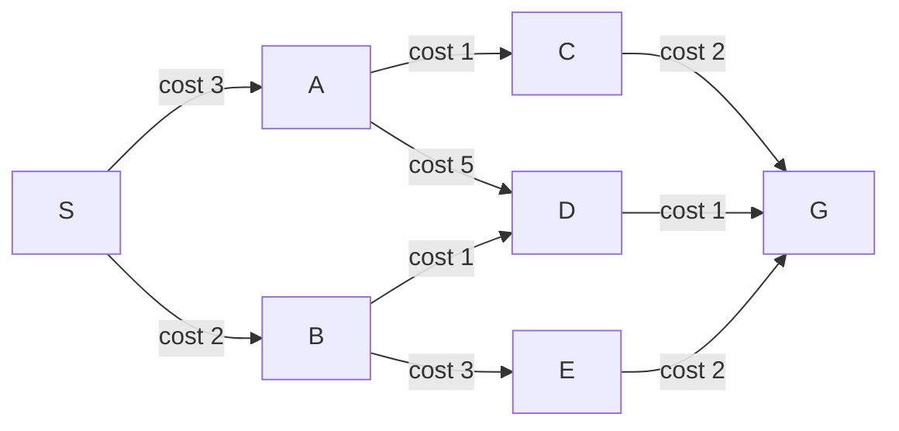
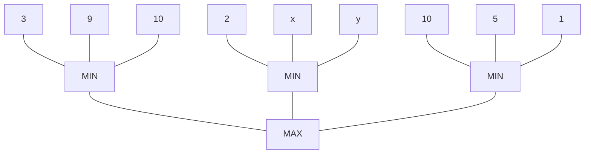

# 07-搜索与经典机器学习

> **本文定位**：覆盖模拟试题中识别出的5个知识缺口——A*搜索、Minimax/Alpha-Beta、线性回归、混淆矩阵、SVM。两份试卷均涉及A*搜索，为高频考点。

---

## 目录

- [一、A* 搜索算法](#一a-搜索算法)
- [二、Minimax与Alpha-Beta剪枝](#二minimax与alpha-beta剪枝)
- [三、线性回归](#三线性回归)
- [四、混淆矩阵与分类指标](#四混淆矩阵与分类指标)
- [五、SVM与核函数](#五svm与核函数)

---

## 一、A* 搜索算法

### 1.1 核心思想

> **直观理解**：A* = Dijkstra + 启发式引导。Dijkstra只看"走了多远"（g），A*加上"离目标还有多远"的估算（h）。就像导航软件：不仅知道你开了多远，还估算到目的地还剩多少路。

**评估函数**：
$$f(n) = g(n) + h(n)$$

| 符号 | 含义 | 来源 |
|------|------|------|
| $g(n)$ | 从起点到节点n的**实际代价** | 已知（走过的路） |
| $h(n)$ | 从节点n到目标的**启发式估计** | 估算（剩余的路） |
| $f(n)$ | 经过n的最优路径的**估计总代价** | g + h |

### 1.2 两个关键性质（必考概念）

| 性质 | 定义 | 保证什么 |
|------|------|---------|
| **可采纳性 (Admissibility)** | $h(n) \le h^*(n)$（永不**高估**实际代价） | 找到**最优解** |
| **一致性 (Consistency / Monotonicity)** | $h(n) \le c(n, a, n') + h(n')$（满足三角不等式） | 更强条件，保证第一次扩展即最优 |

> **关系**：一致性 → 可采纳性（但反过来不一定）。一致性更容易实现和验证。

**通俗理解**：
- 可采纳 = "乐观估计"——估算的剩余距离绝不会比真实距离长
- 一致性 = "三角不等式"——从A到目标的估算 ≤ A到B的实际代价 + B到目标的估算

### 1.3 A* 算法流程

```
1. 初始化：起点S入OPEN表，f(S)=g(S)+h(S)=0+h(S)
2. 循环：
   a. 从OPEN选f值最小的节点n（如有平局，选h小的或任意）
   b. 若n是目标 → 回溯路径，结束
   c. 将n移入CLOSED表
   d. 对n的每个后继n'：
      - g(n') = g(n) + c(n, n')
      - f(n') = g(n') + h(n')
      - 若n'不在OPEN也不在CLOSED → 加入OPEN
      - 若n'已在OPEN且新g更小 → 更新g和f
      - 若n'已在CLOSED且新g更小 → 移回OPEN并更新
3. 若OPEN为空 → 无解
```

### 1.4 手算例题（指令级·必考）

**题目**（来自模拟试题2）：



启发式 $h(n)$:

| n | S | A | B | C | D | E | G |
|---|----|----|----|----|----|----|----|
| $h(n)$ | 4 | 3 | 2 | 1 | 3 | 2 | 0 |

**Step-by-step 手算**：

| Step | OPEN（f值） | 展开 | CLOSED | 说明 |
|------|------------|------|--------|------|
| 0 | S(f=0+4=4) | — | — | 初始 |
| 1 | A(f=3+3=6), B(f=2+2=4) | S | S | B的f最小 |
| 2 | A(f=6), D(f=3+3=6), E(f=5+2=7) | B | S,B | A和D都是6，选A（或任意） |
| 3 | C(f=4+1=5), D(f=6), E(f=7) | A | S,B,A | C的f最小 |
| 4 | G(f=6+0=6), D(f=6), E(f=7) | C | S,B,A,C | D的f=6, G的f=6，选G |
| 5 | G是目标 → 回溯 | G | — | 路径: S→B→D→G |

**最优路径**：S → B → D → G（总代价 = 2+1+1 = 4）

> **手算口诀**：每步选f最小 → 展开生成后继 → 计算后继f=g+h → 重复直到目标。

### 1.5 h(n) 的验证手算

**验证一致性**（对每条边检查三角不等式）：

| 边 | h(n) | c(n,n')+h(n') | 是否满足? |
|----|------|--------------|----------|
| S→A | h(S)=4 | 3+h(A)=3+3=6 | 4$\leq$6 [OK] |
| S→B | h(S)=4 | 2+h(B)=2+2=4 | 4$\leq$4 [OK] |
| A→C | h(A)=3 | 1+h(C)=1+1=2 | 3$\leq$2 [NO] |

> **发现**：h(A)=3 但 c(A,C)+h(C)=1+1=2 → 不满足一致性！但 A* 仍然能工作，因为有 g 值保证。这说明这个h是可采纳但不一致的。

---

## 二、Minimax与Alpha-Beta剪枝

### 2.1 核心思想

> **直观理解**：Max玩家（你）想让局势对自己最有利（值最大），Min玩家（对手）想让局势对你不利（值最小）。Minimax就是假设双方都完美理性，递归推算最优走法。

**Minimax递推**：
- **叶子节点**：值 = 静态评估（如+10=你赢，−10=对手赢，0=平局）
- **Max节点**（你的回合）：值 = max(所有子节点的值)
- **Min节点**（对手回合）：值 = min(所有子节点的值)

### 2.2 手算例题（来自模拟试题1）



**Step 1: Minimax值计算**

| 子树 | 叶子 | min | max |
|------|------|-----|-----|
| 左MIN | 3, 9, 10 | min(3,9,10)=3 | — |
| 中MIN | 2, x, y | min(2,x,y)$\leq$2 | — |
| 右MIN | 10, 5, 1 | min(10,5,1)=1 | — |
| MAX | 3, $\leq$2, 1 | — | max(3, $\leq$2, 1)=3 |

> **关键**：无论x和y取何值，中MIN ≤ 2，所以MAX选3（左子树）。最优路径=左分支。

### 2.3 Alpha-Beta剪枝（指令级·必考）

> **直观理解**：Alpha = "Max目前保证能拿到的底线"（下界），Beta = "Min目前允许Max拿的上限"（上界）。当 $\alpha \geq \beta$ 时，这个分支不可能影响最终决策 → 剪掉。

**Alpha-Beta更新规则**：
- **Max节点**：$\alpha = \max(\alpha$, 子节点返回值)，传给子节点的$\alpha$=当前$\alpha$，$\beta$=父节点$\beta$
- **Min节点**：$\beta = \min(\beta$, 子节点返回值)，传给子节点的$\alpha$=父节点$\alpha$，$\beta$=当前$\beta$
- **剪枝条件**：$\alpha \geq \beta$ 时停止搜索其余子节点

**手算例题**（同一棵树）：

| Step | 位置 | 操作 | α | β | 结果 |
|------|------|------|----|-----|------|
| 1 | MAX | 初始化 | −∞ | +∞ | — |
| 2 | 左MIN | 收到(α=−∞, β=+∞) | −∞ | +∞ | — |
| 3 | 左MIN-3 | 叶子=3 | −∞→**3** | +∞ | — |
| 4 | 左MIN-9 | 叶子=9 | 3 | +∞ | — |
| 5 | 左MIN-10 | 叶子=10 | 3 | +∞ | 返回值=3 |
| 6 | MAX | 收到3 | −∞→**3** | +∞ | — |
| 7 | 中MIN | 收到(α=3, β=+∞) | −∞ | +∞ | — |
| 8 | 中MIN-2 | 叶子=2 | −∞→**2** | +∞→**2** | — |
| | | **$\alpha=3 \geq \beta=2$ → 剪枝！** | | | x和y不再看 |
| 9 | 中MIN | 返回2 | — | — | — |
| 10 | MAX | 收到2, max(3,2,?)=3 | 3 | +∞ | — |
| 11 | 右MIN | 收到(α=3, β=+∞) | −∞ | +∞ | — |
| | | 10→α=3, 5→α=3, 1→α=3 | | | 返回1 |
| 12 | MAX | 最终值 | | | **3** |

> **剪枝效果**：x和y两个节点被剪掉，无需计算。

### 2.4 剪枝效率

- **最佳情况**（子节点按最优顺序排列）：只需检查 O(b^(d/2)) 而非 O(b^d)
- **最坏情况**（子节点按最差顺序排列）：无剪枝，退化为普通Minimax
- **实践建议**：先评估"看起来好"的走法（使用启发式排序）以增加剪枝机会

---

## 三、线性回归

### 3.1 问题形式

给定数据集 $\{(\mathbf{x}_i, y_i)\}_{i=1}^{m}$，$\mathbf{x}_i \in \mathbb{R}^D$，求权重 $\mathbf{w}$ 最小化均方误差：

$$J(\mathbf{w}) = \frac{1}{m}\sum_{i=1}^{m} (\mathbf{w}^T \mathbf{x}_i - y_i)^2$$

### 3.2 正规方程（Normal Equation·必考）

> **直观理解**：不用迭代，直接"一步到位"解出最优权重。代价是矩阵求逆，特征数很大时不可行。

$$\mathbf{w} = (\mathbf{X}^T \mathbf{X})^{-1} \mathbf{X}^T \mathbf{y}$$

| 符号 | 维度 | 含义 |
|------|------|------|
| $\mathbf{X}$ | m × D | 数据矩阵（每行一个样本） |
| $\mathbf{y}$ | m × 1 | 标签向量 |
| $\mathbf{w}$ | D × 1 | 权重向量 |

**计算复杂度**：
- $\mathbf{X}^T\mathbf{X}$：$O(mD^2)$
- 矩阵求逆：$O(D^3)$
- **总复杂度**：$O(mD^2 + D^3)$

**考试例题**（来自模拟试题1）：10000样本，200特征

| 操作 | 复杂度 |
|------|--------|
| $\mathbf{X}^T\mathbf{X}$ | 200×200矩阵，可接受 |
| $(\mathbf{X}^T\mathbf{X})^{-1}$ | 200×200求逆，可接受 |
| $\mathbf{X}^T\mathbf{y}$ | 200×10000 × 10000×1 = 200×1 |
| **结论** | 正规方程可行（D=200不大） |

> **但如果D=10000**：10000×10000矩阵求逆 → $O(10^{12})$ → 不可行！只能用梯度下降。

### 3.3 批量梯度下降（BGD）

> **直观理解**：每轮用**全部样本**算梯度，往下降方向走一小步。方向最准，但每步都很贵。

$$\mathbf{w} \leftarrow \mathbf{w} - \eta \cdot \frac{1}{m} \sum_{i=1}^{m} (\mathbf{w}^T \mathbf{x}_i - y_i) \mathbf{x}_i$$

- 每轮梯度计算量：$O(mD)$
- 例题（m=10000, D=200）：每轮 10000×200 = 2,000,000次乘加

### 3.4 随机梯度下降（SGD）

> **直观理解**：每次只看**一个样本**就更新方向。方向有噪声（晃来晃去），但每步极其便宜。适用于大数据。

$$\mathbf{w} \leftarrow \mathbf{w} - \eta \cdot (\mathbf{w}^T \mathbf{x}_i - y_i) \mathbf{x}_i$$

- 每步计算量：$O(D)$
- 优势：每次更新快，在线学习，可能跳出局部极小
- 劣势：梯度有噪声，收敛曲线震荡

### 3.5 三种方法对比（必考）

| 方法 | 每步复杂度 | 适用场景 | 收敛 |
|------|-----------|---------|------|
| **正规方程** | $O(mD^2+D^3)$ | D小（D≤几千） | 一步到最优 |
| **BGD** | $O(mD)$/轮 | D大但m适中 | 稳定下降 |
| **SGD** | $O(D)$/步 | m很大 | 震荡但快速 |

---

## 四、混淆矩阵与分类指标

### 4.1 混淆矩阵（Confusion Matrix）

> **直观理解**：把模型的预测结果分成四类——预测√实际√（真阳TP）、预测√实际[NO]（假阳FP）、预测[NO]实际√（假阴FN）、预测[NO]实际[NO]（真阴TN）。

| | 预测正 | 预测负 |
|---|--------|--------|
| **实际正** | **TP**（正确检出） | **FN**（漏检） |
| **实际负** | **FP**（误报） | **TN**（正确排除） |

### 4.2 核心指标（必考手算）

| 指标 | 公式 | 含义 | 什么时候重要 |
|------|------|------|-------------|
| **Accuracy** | $\frac{TP+TN}{TP+FP+FN+TN}$ | 总体正确率 | 类别均衡时 |
| **Precision（精确率）** | $\frac{TP}{TP+FP}$ | 预测为正的有多少是对的 | 误报代价大（如垃圾邮件） |
| **Recall（召回率）** | $\frac{TP}{TP+FN}$ | 实际为正的有多少被找回 | 漏检代价大（如癌症筛查） |
| **F1 Score** | $\frac{2 \times P \times R}{P + R}$ | P和R的调和平均 | 需要同时平衡P和R |

### 4.3 手算例题（指令级·来自模拟试题2）

**题目**：TP=80, FP=40, FN=20, TN=60

| Step | 指标 | 计算 |
|------|------|------|
| 0 | N = 80+20+40+60 | **200** |
| 1 | Accuracy | (80+60)/200 = 140/200 = **0.70** |
| 2 | Precision | 80/(80+40) = 80/120 = **0.667** |
| 3 | Recall | 80/(80+20) = 80/100 = **0.80** |
| 4 | F1 | 2$\times$0.667$\times$0.8/(0.667+0.8) = 1.0672/1.467 = **0.727** |

> **手算口诀**：
> - Acc = 对角线之和 / 总数
> - P = TP / 预测正列之和
> - R = TP / 实际正行之和
> - F1 = 2PR/(P+R)

### 4.4 P-R trade-off

> **直观理解**：提高阈值 → 更保守 → Precision↑但Recall↓。降低阈值 → 更激进 → Recall↑但Precision↓。F1是它们的折中。

---

## 五、SVM与核函数

### 5.1 SVM核心思想

> **直观理解**：SVM在两类样本之间画一条"最大间隔"的分界线。它不仅要求分对，还要求分界线离最近的样本点**尽可能远**——这个"留白"让它泛化能力更强。

**关键概念**：
- **支持向量**：离决策边界最近的样本点（只有它们决定边界位置）
- **最大间隔**：最大化 $\frac{2}{\|\mathbf{w}\|}$（等价于最小化 $\|\mathbf{w}\|^2$）

### 5.2 核函数（Kernel Function·必考概念）

> **直观理解**：数据在原空间线性不可分（如XOR），但映射到更高维度后可能变得线性可分。核函数**不需要显式计算高维映射**，直接计算高维空间中的点积。

$$K(\mathbf{x}_i, \mathbf{x}_j) = \phi(\mathbf{x}_i)^T \phi(\mathbf{x}_j)$$

**核技巧（Kernel Trick）**：任何只涉及样本间内积的算法，都可以将内积替换为核函数 → 隐式地在高维空间运行。

**常见核函数**：

| 核函数 | 公式 | 参数 | 特点 |
|--------|------|------|------|
| **线性核** | $K(x_i, x_j) = x_i^T x_j$ | — | 等价于原空间的线性SVM |
| **多项式核** | $K(x_i, x_j) = (x_i^T x_j + c)^d$ | d=次数, c=常数 | 映射到d次多项式特征空间 |
| **RBF/高斯核** | $K(x_i, x_j) = \exp(-\gamma\|x_i-x_j\|^2)$ | γ=宽度参数 | **最常用**，映射到无穷维 |
| **Sigmoid核** | $K(x_i, x_j) = \tanh(\alpha x_i^T x_j + c)$ | α, c | 类似神经网络激活 |

### 5.3 核函数的直观理解

> **RBF核**：两样本越近 → K越大（接近1）；两样本越远 → K越小（接近0）。就像"相似度测量仪"——在一个样本周围画一个圆，圆内（相似度高）的样本受它影响大。

### 5.4 SVM vs 神经网络

| | SVM | 神经网络 |
|---|---|---|
| **优化** | **凸优化**（全局最优保证） | 非凸（可能陷入局部极小） |
| **可解释性** | 支持向量可解释 | 黑盒 |
| **大数据** | 核矩阵O(m²)不可行 | 可扩展（SGD/GPU） |
| **时代** | 1990s~2000s主导 | 2010s后主导（深度学习崛起前SVM是王者） |

> **考试点**："为什么SVM在神经网络低潮期兴起？"——因为它有凸优化保证（全局最优），而非凸的神经网络当时算力不足、训练困难。

---

## 附录：公式速查表

### A* 搜索

| 公式 | 用途 |
|------|------|
| $f(n) = g(n) + h(n)$ | 评估函数 |
| $h(n) \le h^*(n)$ | 可采纳性（保证最优） |
| $h(n) \le c(n,n') + h(n')$ | 一致性（三角不等式） |

### Minimax / Alpha-Beta

| 公式 | 用途 |
|------|------|
| MAX节点 = max(子节点值) | 你的回合 |
| MIN节点 = min(子节点值) | 对手回合 |
| $\alpha \geq \beta \to$ 剪枝 | 剪枝条件 |

### 线性回归

| 公式 | 用途 |
|------|------|
| $\mathbf{w} = (\mathbf{X}^T\mathbf{X})^{-1}\mathbf{X}^T\mathbf{y}$ | 正规方程 |
| $\mathbf{w} \leftarrow \mathbf{w} - \eta\frac{1}{m}\sum(\mathbf{w}^T\mathbf{x}_i - y_i)\mathbf{x}_i$ | BGD |
| $\mathbf{w} \leftarrow \mathbf{w} - \eta(\mathbf{w}^T\mathbf{x}_i - y_i)\mathbf{x}_i$ | SGD |

### 分类指标

| 公式 | 用途 |
|------|------|
| $Acc = \frac{TP+TN}{N}$ | 准确率 |
| $P = \frac{TP}{TP+FP}$ | 精确率 |
| $R = \frac{TP}{TP+FN}$ | 召回率 |
| $F1 = \frac{2PR}{P+R}$ | F1分数 |

### SVM核函数

| 公式 | 用途 |
|------|------|
| $K(x_i, x_j) = \phi(x_i)^T\phi(x_j)$ | 核函数定义（核技巧） |
| $K(x_i, x_j) = \exp(-\gamma\|x_i-x_j\|^2)$ | RBF/高斯核（最常用） |

---

> **跨文档链接**：
> - MDP与强化学习 → [06-强化学习](06-强化学习：从老虎机到深度RL.md)
> - 一阶逻辑形式化 → [01-符号主义AI](01-符号主义AI：逻辑、知识表示与专家系统.md) §三
> - BP手算、Softmax → [03-神经网络](03-神经网络：从感知机到深度学习.md)
> - 贝叶斯网络推理 → [02-概率推理](02-概率推理与不确定性处理.md) §三
> - CNN参数计算 → [03-神经网络](03-神经网络：从感知机到深度学习.md) §六
> - GAN → [03-神经网络](03-神经网络：从感知机到深度学习.md) §十一
> - Transformer → [03-神经网络](03-神经网络：从感知机到深度学习.md) §九
> - 正则化 L2/Weight Decay → [03-神经网络](03-神经网络：从感知机到深度学习.md) §十
